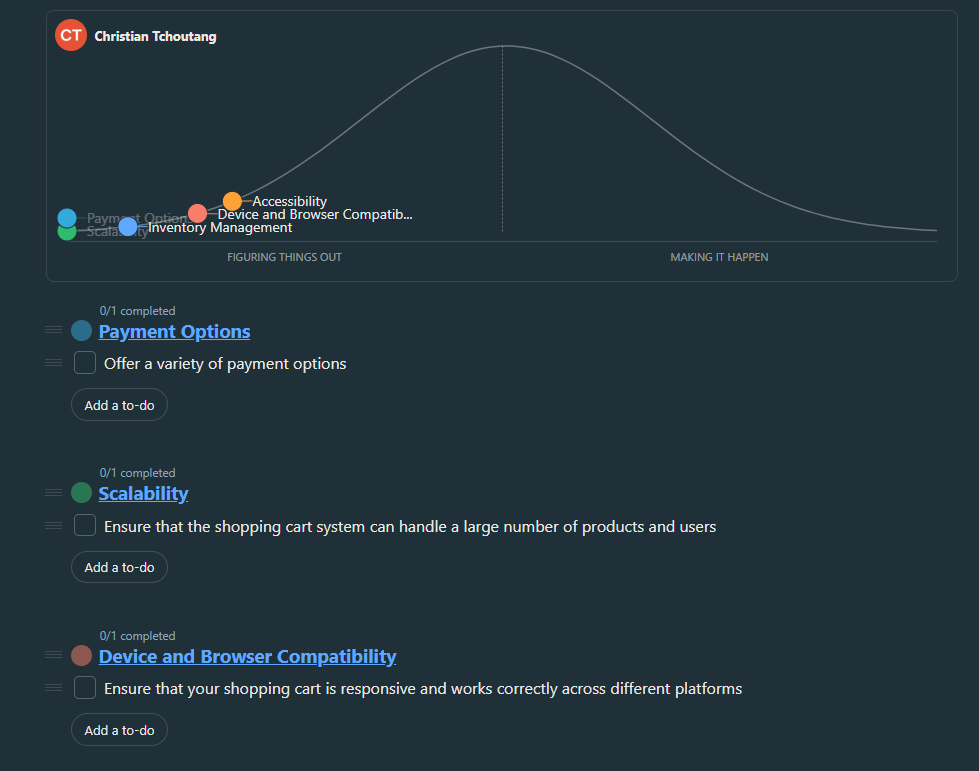

#### Focus on one piece
The winning pitch is the shopping cart feature. Much like the backbone of most successful e-commerce platforms, the shopping cart is the unsung hero that significantly influences how our users select and purchase products. it's the bridge that connects the 'browsing' to 'buying' in the most effortless way.  
Our platform's existing shopping cart is not user-friendly, which hinders user experience and sales. In order to address this issue, we will design an easy-to-use cart for adding, viewing, and updating items.   
The cart will be accessible from all pages, and also clearly displays the current total price.    
#### Scope Map:
1. Shopping Cart Redesign (High-Level Scope):
   ##### Features:
   - Add items to the cart
   - View and update items in the cart
   - Accessibility improvements
   - Device and browser compatibility
   - Integration with inventory management
   - Payment options enhancement
   - Scalability for increased user traffic
2. Accessibility (Detailed Scope):
   ##### Tasks:
   - Conduct accessibility audit on existing cart
   - Identify and implement WCAG standards
   - Ensure keyboard navigation for all functionalities
   - Provide alternative text for images
   - Test with screen readers and other assistive technologies
3. Device and Browser Compatibility (Detailed Scope):
   ##### Tasks:
   - Analyze current user analytics for popular devices and browsers
   - Implement responsive design principles
   - Test on various devices and browsers
   - Address any compatibility issues
   - Optimize for mobile and tablet experiences
4. Inventory Management Integration (Detailed Scope):
   ##### Tasks:
   - Collaborate with the inventory management team
   - Define APIs for real-time inventory updates
   - Implement seamless integration points
   - Test synchronization of inventory updates
   - Handle scenarios of out-of-stock items gracefully
5. Payment Options Integration (Detailed Scope):
   ##### Tasks:
   - Review existing payment options
   - Explore additional payment methods
   - Integrate a secure payment gateway
   - Test various payment scenarios
   - Ensure a smooth and secure checkout process
6. Scalability and Performance Testing (Detailed Scope):
   ##### Tasks:
   - Discuss expected user traffic and sales growth
   - Define strategies for scalability
   - Conduct performance testing
   - Optimize code and database queries for efficiency
   - Implement caching mechanisms for improved performance

## Meeting minutes and Updates

## week6: Meeting of Tue, 28 Nov 

**Headlines:**
Meeting with team

**Notes:**
- Demonstrate the fully implemented shopping cart
- Conduct user acceptance testing
- Address final feedback and prepare for rollout

HillChart:   
 

## week5: Meeting of Tue, 21 Nov 

**Headlines:**
Meeting with team

**Notes:**
- Discuss expected user traffic and sales growth
- Implement strategies for scalability
- Conduct performance testing and optimizations

HillChart:   
 

## week4: Meeting of Tue, 14 Nov 

**Headlines:**
Meeting with team

**Notes:**
- Review current payment options
- Explore additional payment methods
- Integrate a secure payment gateway
  
HillChart:   

## week3: Meeting of 07, nov 

**Headlines:**
- Meeting with team

**Notes:**
- Discuss inventory management system integration
- Collaborate with the inventory management team
- Define requirements for seamless synchronization

- **Minute meetings:**
- 56 mn 50s

HillChart:   
 

## week2: Meeting of Tuesday, 31 october 

**Headlines:**
- Meeting with team

**Notes:**
- Review compatibility analysis results
- Identify target devices and browsers
- Assign tasks for responsive design implementation

**Minute meetings:**
- 36 mn 50s

## week1: Meeting of Tuesday, 24 october 

**Headlines:**

- Meeting with team

**Notes:**
- Conduct initial accessibility research
- Assign team members for accessibility audit
- Set goals for accessibility compliance

**Minute meetings:**
- 36 mn 50s
